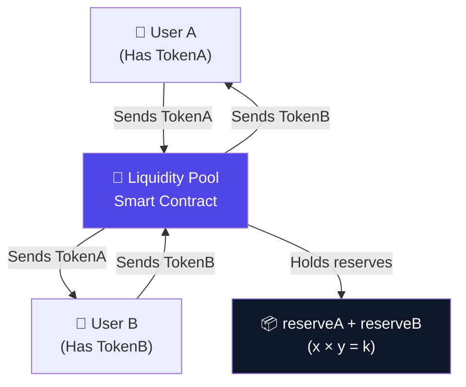
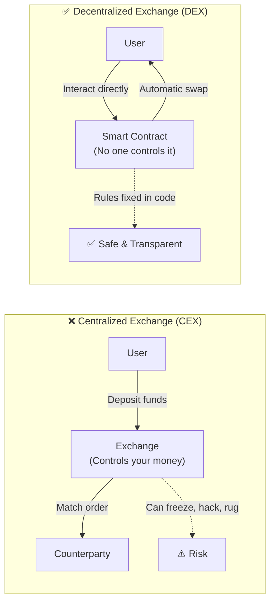
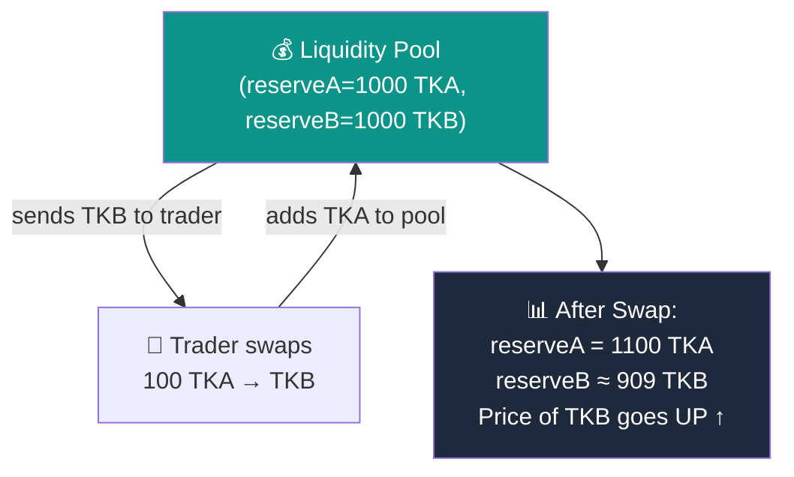
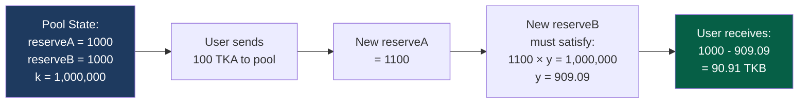
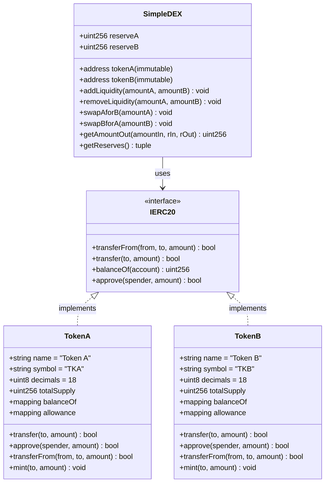
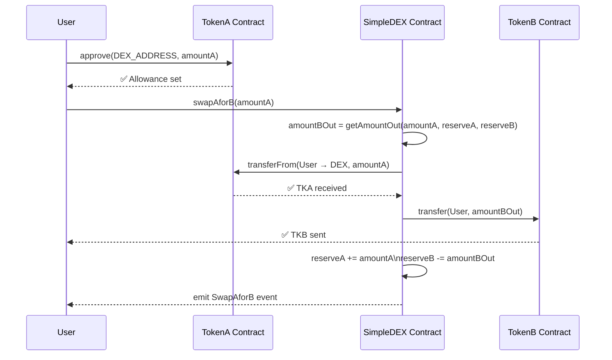

# SimpleDEX

> A minimal **Automated Market Maker (AMM)** Decentralized Exchange built from scratch using Solidity, Hardhat, and ethers.js — deployed on Ethereum Sepolia testnet.

[](https://soliditylang.org/)
[](https://sepolia.etherscan.io/)
[](./LICENSE)

---

## Table of Contents

1. [What is a DEX?](#what-is-a-dex)
2. [DEX vs CEX — Advantages](#dex-vs-cex--advantages-no-middleman)
3. [What is Liquidity?](#what-is-liquidity)
4. [Liquidity Providers](#liquidity-providers)
5. [Constant Product Formula](#constant-product-formula)
6. [Contract Structure](#contract-structure)
7. [Contract Usage](#contract-usage)
8. [Deployed Contracts](#-deployed-contracts-sepolia-testnet)
9. [Project Structure](#project-structure)
10. [Setup & Installation](#setup--installation)
11. [Deployment](#deployment)
12. [Frontend Setup](#frontend-setup)
13. [Security Notes](#security-notes)

---

## What is a DEX?

A **Decentralized Exchange (DEX)** is a peer-to-peer marketplace where users can trade cryptocurrencies directly with each other — **without a central authority** like a bank or an exchange company controlling the funds.

Unlike traditional exchanges (Coinbase, Binance), a DEX runs entirely on **smart contracts** deployed on a blockchain. The rules are written in code, transparent, and cannot be changed or manipulated by anyone — including the creators.



**Key properties of a DEX:**
- 🔓 **Non-custodial** — you always control your private keys
- 📖 **Transparent** — all code is open source and on-chain
- 🌐 **Permissionless** — anyone can trade or provide liquidity without an account
- 🤖 **Automated** — pricing is handled by an algorithm (AMM), not humans

---

## DEX vs CEX — Advantages (No Middleman)

A **Centralized Exchange (CEX)** like Binance or Coinbase acts as a middleman — they hold your funds, match your orders, and can freeze your account.

A **DEX** removes this middleman entirely.



| Feature | CEX | DEX |
|---|---|---|
| Custody of funds | Exchange holds them | You hold them |
| KYC Required | ✅ Yes | ❌ No |
| Can be hacked/frozen | ✅ Yes | ❌ No (only smart contract risk) |
| 24/7 availability | Depends | ✅ Always |
| Transparent pricing | ❌ Hidden order book | ✅ On-chain formula |
| Permissionless | ❌ Account required | ✅ Just a wallet |

---

## What is Liquidity?

**Liquidity** refers to how easily an asset can be bought or sold without significantly affecting its price.

In a DEX, liquidity is not provided by an order book — instead, users **deposit pairs of tokens** into a **liquidity pool** (a smart contract). These pooled tokens are then available for anyone to swap against.



**Why does price change?**
- The pool always maintains `x × y = k`
- When you buy more of token B, its reserve shrinks → its price rises
- This is **automatic price discovery** without any human intervention

**High liquidity = small price impact per trade**
**Low liquidity = large price impact (slippage) per trade**

---

## Liquidity Providers

**Liquidity Providers (LPs)** are users who deposit equal-value amounts of both tokens into the pool. In return, they earn trading fees on every swap (in production DEXes like Uniswap).


**In production AMMs (e.g. Uniswap v2):**
- LPs receive **LP tokens** proportional to their share of the pool
- They earn a **0.3% fee** on every swap
- They can redeem LP tokens to withdraw their share + accumulated fees

> ⚠️ **This SimpleDEX** has no LP tokens and no fees — it's for learning purposes only.

---

## Constant Product Formula

The heart of any AMM is the **constant product invariant**:

```
x × y = k
```

Where:
- `x` = reserve of TokenA in the pool
- `y` = reserve of TokenB in the pool
- `k` = a constant that **never changes** during a swap

### How a Swap is Priced



**The formula used in this contract:**

```
amountOut = (amountIn × reserveOut) / (reserveIn + amountIn)
```

### Numerical Example

| State | reserveA (TKA) | reserveB (TKB) | k |
|---|---|---|---|
| Initial | 1000 | 1000 | 1,000,000 |
| Swap 100 TKA → TKB | 1100 | 909.09 | 1,000,000 ✅ |
| Swap 200 TKA → TKB | 1300 | 769.23 | 1,000,000 ✅ |

**Key insight:** The more you buy, the worse your rate — this is called **price impact / slippage**. Large trades in small pools get worse prices.

### Price Curve

The constant product formula creates a **hyperbolic curve** where reserves can never reach zero:

```
         TKB
          |
    1000  |*
          | *
     500  |   *
          |      *
     200  |          *
          |                *
          +--+--+--+--+--+--+-- TKA
           200 500 1000 2000
```

> The curve asymptotically approaches the axes — meaning you can never drain a pool to zero.

---

## Contract Structure



### File Overview

| File | Purpose |
|---|---|
| `contracts/TokenA.sol` | ERC20 token (TKA) — manual implementation, no OpenZeppelin |
| `contracts/TokenB.sol` | ERC20 token (TKB) — identical structure to TokenA |
| `contracts/SimpleDEX.sol` | AMM DEX — holds liquidity pool, handles swaps |
| `scripts/deploy.js` | Deploys all 3 contracts in sequence to any Hardhat network |
| `frontend/index.html` | Single-page app UI |
| `frontend/script.js` | ethers.js wallet + contract interaction logic |
| `hardhat.config.js` | Hardhat config with Sepolia network + dotenv |

---

## Contract Usage

### TokenA / TokenB — ERC20 Functions

| Function | Signature | Description |
|---|---|---|
| `balanceOf` | `balanceOf(address) → uint256` | Returns token balance of an address |
| `transfer` | `transfer(address to, uint256 amount) → bool` | Send tokens to another wallet |
| `approve` | `approve(address spender, uint256 amount) → bool` | Allow DEX to spend your tokens |
| `allowance` | `allowance(address owner, address spender) → uint256` | Check approved amount |
| `transferFrom` | `transferFrom(address from, address to, uint256 amount) → bool` | DEX calls this to pull tokens from your wallet |
| `mint` | `mint(address to, uint256 amount)` | Mint test tokens (open access — dev only) |

### SimpleDEX — Core Functions

| Function | Signature | Description |
|---|---|---|
| `addLiquidity` | `addLiquidity(uint256 amountA, uint256 amountB)` | Deposit both tokens into the pool. Requires prior `approve()` on both tokens. |
| `removeLiquidity` | `removeLiquidity(uint256 amountA, uint256 amountB)` | Withdraw tokens from the pool. Fails if pool has insufficient reserves. |
| `swapAforB` | `swapAforB(uint256 amountA)` | Sell TKA, receive TKB. Price set by constant product formula. |
| `swapBforA` | `swapBforA(uint256 amountB)` | Sell TKB, receive TKA. |
| `getAmountOut` | `getAmountOut(uint256 amountIn, uint256 reserveIn, uint256 reserveOut) → uint256` | Pure view — preview swap output amount. |
| `getReserves` | `getReserves() → (uint256, uint256)` | Returns current `(reserveA, reserveB)`. |

### Swap Flow (Step by Step)



### Events Emitted

| Event | When Triggered |
|---|---|
| `LiquidityAdded(provider, amountA, amountB)` | On successful `addLiquidity()` |
| `LiquidityRemoved(provider, amountA, amountB)` | On successful `removeLiquidity()` |
| `SwapAforB(user, amountAIn, amountBOut)` | On successful TKA → TKB swap |
| `SwapBforA(user, amountBIn, amountAOut)` | On successful TKB → TKA swap |

---

## 🚀 Deployed Contracts (Sepolia Testnet)

| Contract | Address | Etherscan |
|---|---|---|
| **TokenA (TKA)** | `0x70755E14980418aDe2dded4E5ab4DDA21379c97d` | [View ↗](https://sepolia.etherscan.io/address/0x70755E14980418aDe2dded4E5ab4DDA21379c97d) |
| **TokenB (TKB)** | `0x94f16aE8A8864F9d0977f2595661367B8aff974a` | [View ↗](https://sepolia.etherscan.io/address/0x94f16aE8A8864F9d0977f2595661367B8aff974a) |
| **SimpleDEX** | `0x40d623F3FE713DE8D812ebd63A5f408E37A09aDe` | [View ↗](https://sepolia.etherscan.io/address/0x40d623F3FE713DE8D812ebd63A5f408E37A09aDe) |

> 🌐 Network: **Ethereum Sepolia Testnet** (Chain ID: 11155111)

---

## Project Structure

```
simple-dex/
├── contracts/
│   ├── TokenA.sol        # ERC20 token (TKA) — manual implementation
│   ├── TokenB.sol        # ERC20 token (TKB) — manual implementation
│   └── SimpleDEX.sol     # AMM DEX — constant product formula
│
├── scripts/
│   └── deploy.js         # Deploys TokenA, TokenB, then SimpleDEX
│
├── frontend/
│   ├── index.html        # Single-page UI
│   ├── style.css         # Styles
│   ├── script.js         # ethers.js wallet + contract integration
│   └── ethers.min.js     # ethers.js v5 (local copy)
│
├── hardhat.config.js     # Hardhat + Sepolia network config
├── package.json
├── .env.example          # Template for environment variables
└── .gitignore
```

---

## Setup & Installation

### Prerequisites

| Tool | Version |
|---|---|
| Node.js | ≥ 18 |
| npm | ≥ 9 |
| MetaMask | Latest browser extension |
| Sepolia ETH | Get from [sepoliafaucet.com](https://sepoliafaucet.com) |

### 1. Clone the repository

```bash
git clone <repo-url>
cd simple-dex
```

### 2. Install dependencies

```bash
npm install
```

### 3. Configure environment variables

```bash
cp .env.example .env
```

Edit `.env` and fill in:

```env
ALCHEMY_URL=https://eth-sepolia.g.alchemy.com/v2/<your-key>
PRIVATE_KEY=<your-wallet-private-key-without-0x>
```

> ⚠️ **Security:** Never commit your `.env` file. The `.gitignore` already excludes it.

---

## Deployment

### Compile contracts

```bash
npm run compile
```

### Deploy to Sepolia

```bash
npm run deploy:sepolia
```

**Expected output:**

```
Deploying contracts with account: 0xYourAddress
Deployer balance: X.XX ETH

TokenA deployed to:   0xAAA...
TokenB deployed to:   0xBBB...
SimpleDEX deployed to: 0xCCC...

─────────────────────────────────────────────
✅  Deployment complete. Update frontend/script.js with:
─────────────────────────────────────────────
  TOKEN_A_ADDRESS = "0xAAA..."
  TOKEN_B_ADDRESS = "0xBBB..."
  DEX_ADDRESS     = "0xCCC..."
```

### Deploy to local Hardhat node (for development)

```bash
# Terminal 1 – start local node
npm run node

# Terminal 2 – deploy
npm run deploy:local
```

---

## Frontend Setup

### 1. Update contract addresses

Open `frontend/script.js` and set the deployed addresses:

```js
const TOKEN_A_ADDRESS = "0xAAA...";
const TOKEN_B_ADDRESS = "0xBBB...";
const DEX_ADDRESS     = "0xCCC...";
```

### 2. Run the frontend

```bash
npm run dev
```

Or just open `frontend/index.html` directly in your browser.

### 3. Use the DEX

1. Click **Connect Wallet** — MetaMask will prompt for access.
2. Ensure you are on the **Sepolia** network in MetaMask.
3. **Mint tokens** — via [Etherscan Write Contract](https://sepolia.etherscan.io/address/0x70755E14980418aDe2dded4E5ab4DDA21379c97d#writeContract) if your wallet has none.
4. **Add Liquidity** — enter amounts of TKA and TKB, approve, then deposit.
5. **Swap** — enter an input amount, check the estimated output, confirm.
6. **Remove Liquidity** — enter amounts to withdraw back.

---

## Testing

```bash
npm run test
```

Tests should be placed in the `test/` directory (create as needed).

---

## Security Notes

This project is for **educational purposes only**.

- ❌ No LP tokens — liquidity removal is not proportional to share
- ❌ No trading fee — not production-ready
- ❌ `mint()` is open to any address — not production-ready
- ❌ Not audited

---

## License

MIT
