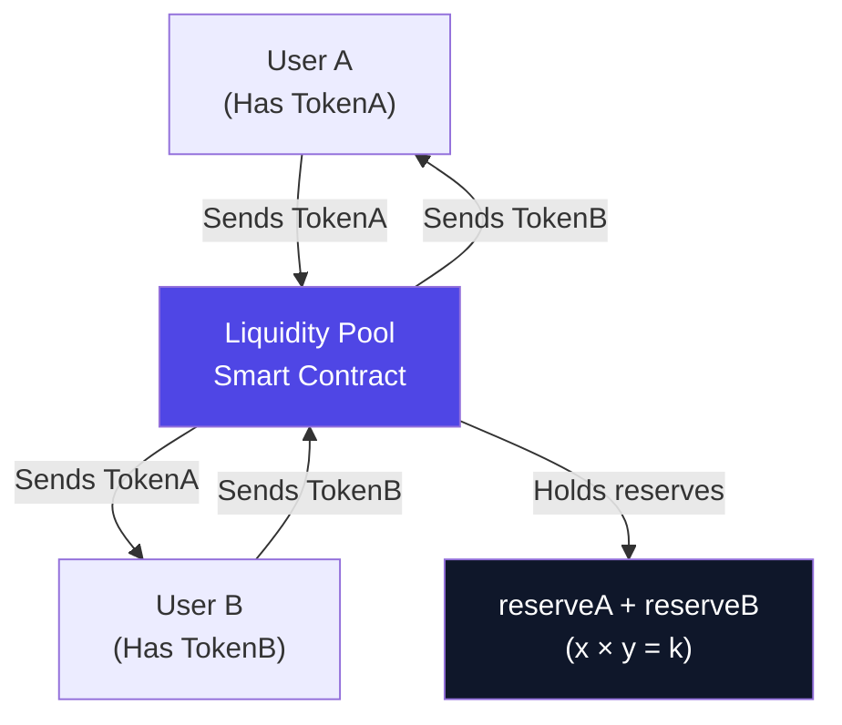
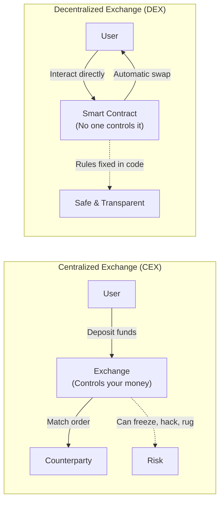
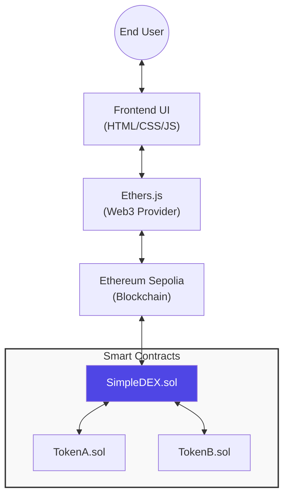
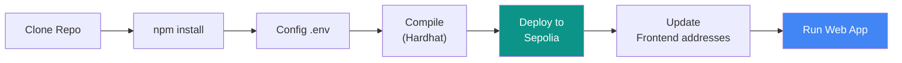
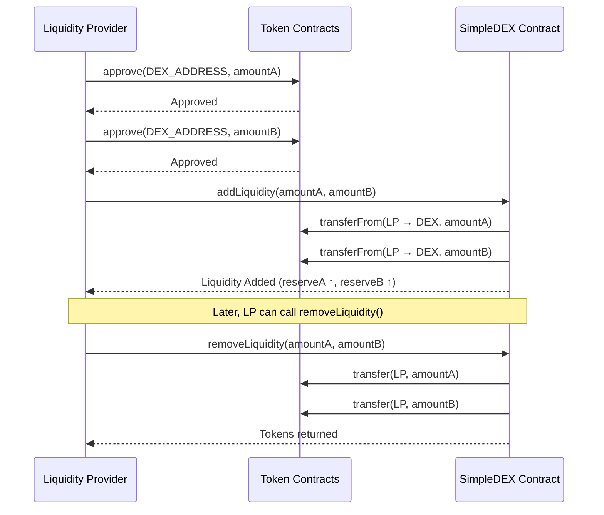
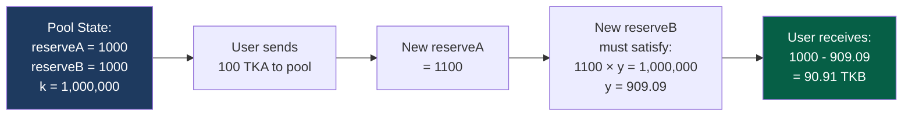
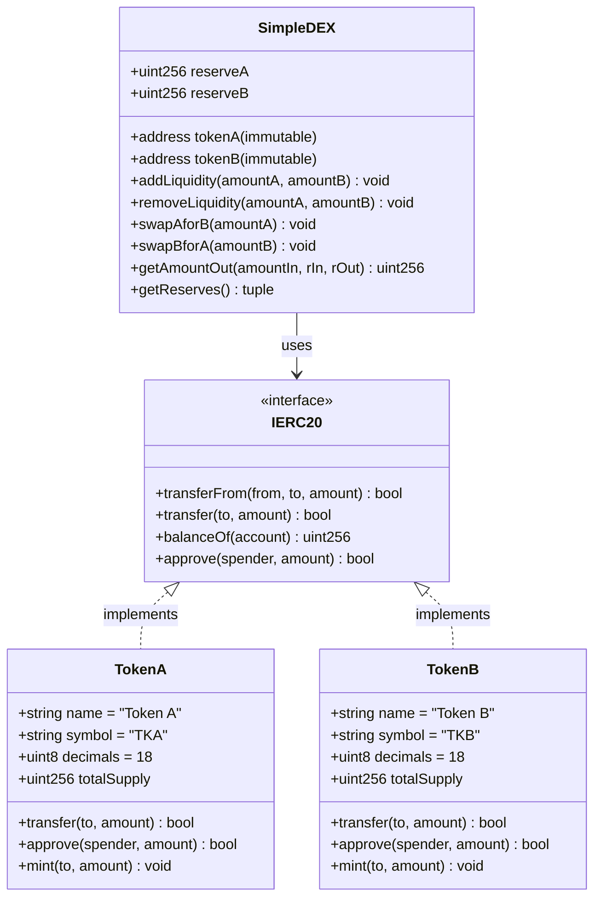

<h1 align="center">SimpleDEX</h1>

<p align="center">
  <strong>A minimal Automated Market Maker (AMM) Decentralized Exchange built from scratch</strong>
</p>

<p align="center">
  
  
  
  
</p>

<p align="center">
  <b>Live Demo: <a href="https://simple-dex-swap-liquidity.vercel.app/">simple-dex-swap-liquidity.vercel.app</a></b><br>
  <b>Transaction Proof: <a href="https://sepolia.etherscan.io/tx/0xf118a9b4a60afa330e07e184247073cc8eb8c7f2e819a99af215a6495265850c">View on Etherscan</a></b>
</p>

<p align="center">
  <b>Demo Video</b><br>
  <a href="https://drive.google.com/file/d/1vyswDItxr5KoJ6YzRZfUqMT-wZEwe6dQ/view?usp=drivesdk">
    
  </a>
</p>

<p align="center">
  <i>SimpleDEX allows users to swap ERC20 tokens and provide liquidity using the constant-product formula (x * y = k) on the Sepolia testnet.</i>
</p>

---

## Table of Contents

1. [What is a DEX?](#what-is-a-dex)
2. [DEX vs CEX — Advantages](#dex-vs-cex--advantages-no-middleman)
3. [System Architecture](#system-architecture)
4. [Task Pipeline](#task-pipeline)
5. [What is Liquidity?](#what-is-liquidity)
6. [Liquidity Providers](#liquidity-providers)
7. [Constant Product Formula](#constant-product-formula)
8. [Contract Structure](#contract-structure)
9. [Contract Usage](#contract-usage)
10. [Deployed Contracts](#deployed-contracts-sepolia-testnet)
11. [Project Structure](#project-structure)
12. [Setup & Installation](#setup--installation)
13. [Deployment](#deployment)
14. [Frontend Setup](#frontend-setup)
15. [Security Notes](#security-notes)

---

## What is a DEX?

A **Decentralized Exchange (DEX)** is a peer-to-peer marketplace where users can trade cryptocurrencies directly with each other — **without a central authority** like a bank or an exchange company controlling the funds.

Unlike traditional exchanges (Coinbase, Binance), a DEX runs entirely on **smart contracts** deployed on a blockchain. The rules are written in code, transparent, and cannot be changed or manipulated by anyone — including the creators.



**Key properties of a DEX:**
- Non-custodial — you always control your private keys
- Transparent — all code is open source and on-chain
- Permissionless — anyone can trade or provide liquidity without an account
- Automated — pricing is handled by an algorithm (AMM), not humans

---

## DEX vs CEX — Advantages (No Middleman)

A **Centralized Exchange (CEX)** like Binance or Coinbase acts as a middleman — they hold your funds, match your orders, and can freeze your account.

A **DEX** removes this middleman entirely.



| Feature | CEX | DEX |
|---|---|---|
| Custody of funds | Exchange holds them | You hold them |
| KYC Required | Yes | No |
| Can be hacked/frozen | Yes | No (only smart contract risk) |
| 24/7 availability | Depends | Always |
| Transparent pricing | Hidden order book | On-chain formula |
| Permissionless | Account required | Just a wallet |

---

## System Architecture

The following diagram illustrates the high-level architecture of SimpleDEX, showing the interaction between the user interface and the blockchain.



---

## Task Pipeline

The deployment and development workflow for the project follows these sequential steps.



---

## What is Liquidity?

**Liquidity** refers to how easily an asset can be bought or sold without significantly affecting its price.

In a DEX, liquidity is not provided by an order book — instead, users **deposit pairs of tokens** into a **liquidity pool** (a smart contract). These pooled tokens are then available for anyone to swap against.


---

## Liquidity Providers

**Liquidity Providers (LPs)** are users who deposit equal-value amounts of both tokens into the pool. In return, they earn trading fees on every swap (in production DEXes like Uniswap).



---

## Constant Product Formula

The heart of any AMM is the **constant product invariant**:

```
x × y = k
```

### How a Swap is Priced



**The formula used in this contract:**

```
amountOut = (amountIn × reserveOut) / (reserveIn + amountIn)
```

---

## Contract Structure



---

## Contract Usage

### TokenA / TokenB — ERC20 Functions

| Function | Signature | Description |
|---|---|---|
| `balanceOf` | `balanceOf(address) → uint256` | Returns token balance of an address |
| `transfer` | `transfer(address to, uint256 amount) → bool` | Send tokens to another wallet |
| `approve` | `approve(address spender, uint256 amount) → bool` | Allow DEX to spend your tokens |
| `mint` | `mint(address to, uint256 amount)` | Mint test tokens (open access — dev only) |

### SimpleDEX — Core Functions

| Function | Signature | Description |
|---|---|---|
| `addLiquidity` | `addLiquidity(uint256 amountA, uint256 amountB)` | Deposit both tokens into the pool. |
| `removeLiquidity` | `removeLiquidity(uint256 amountA, uint256 amountB)` | Withdraw tokens from the pool. |
| `swapAforB` | `swapAforB(uint256 amountA)` | Sell TKA, receive TKB. |
| `swapBforA` | `swapBforA(uint256 amountB)` | Sell TKB, receive TKA. |

---

## Deployed Contracts (Sepolia Testnet)

| Contract | Address | Etherscan |
|---|---|---|
| **TokenA (TKA)** | `0x70755E14980418aDe2dded4E5ab4DDA21379c97d` | [View ↗](https://sepolia.etherscan.io/address/0x70755E14980418aDe2dded4E5ab4DDA21379c97d) |
| **TokenB (TKB)** | `0x94f16aE8A8864F9d0977f2595661367B8aff974a` | [View ↗](https://sepolia.etherscan.io/address/0x94f16aE8A8864F9d0977f2595661367B8aff974a) |
| **SimpleDEX** | `0x40d623F3FE713DE8D812ebd63A5f408E37A09aDe` | [View ↗](https://sepolia.etherscan.io/address/0x40d623F3FE713DE8D812ebd63A5f408E37A09aDe) |

---

## Project Structure

```
simple-dex/
├── contracts/        # Smart Contracts (Solidity)
├── scripts/          # Deployment Scripts
├── frontend/         # Web Application UI
├── hardhat.config.js # Hardhat Configuration
└── package.json      # Dependencies
```

---

## Setup & Installation

1. **Clone the repository**
2. **Install dependencies**: `npm install`
3. **Configure .env**: Add `ALCHEMY_URL` and `PRIVATE_KEY`
4. **Deploy**: `npm run deploy:sepolia`
5. **Run Frontend**: `npm run dev`

---

## Security Notes

This project is for **educational purposes only**. It is not audited and does not include LP tokens or trading fees.

---

## License

MIT
